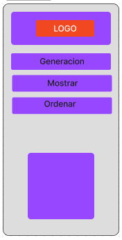
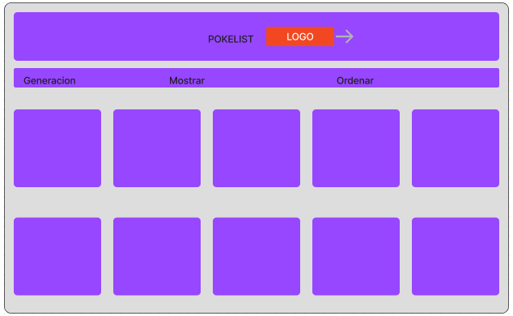
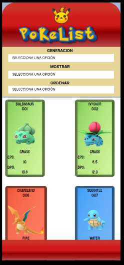
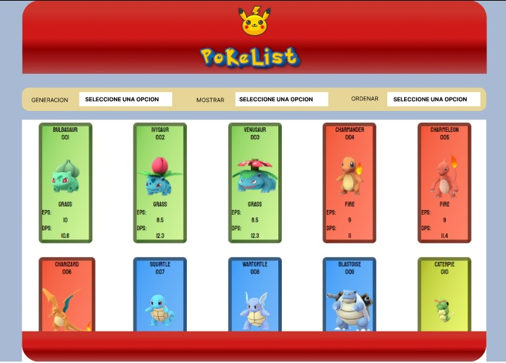
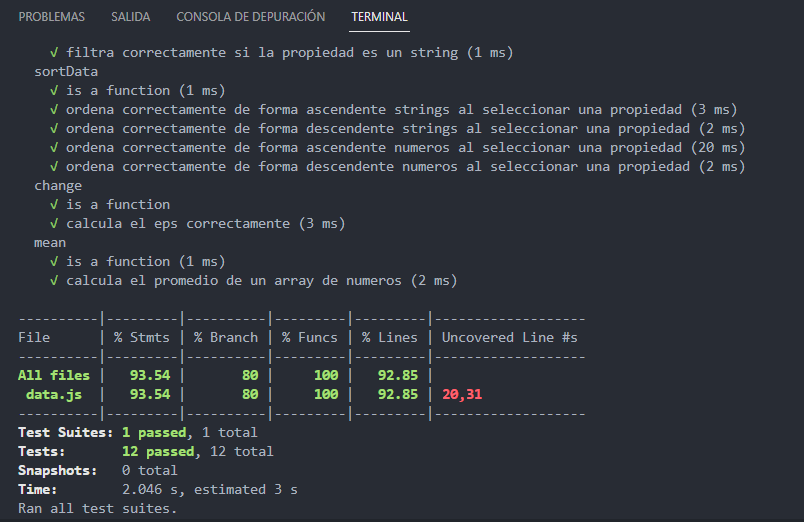

# PokeList

## Índice

* [1. Resumen](#resumen)
* [2. Historias de usuario](#historias-de-usuario)
* [3. Prototipos](#prototipos)

 

***

## Resumen 
PoKéLiSt es un sitio en donde cualquier persona interesada en conocer el mundo de los Pokémon puede comenzar, ya que en este lugar se puede visualizar la información básica de cada uno (nombre, número, tipo, imagen) de forma clara, los fans de la serie de Pokémon pueden encontrar las listas de los Pokémon correspondientes a las dos primeras generaciones y filtrarlas de acuerdo a la rareza del Pokémon (normal, mítico, legendario). Además, para quienes son jugadores principiantes de Pokémon GO, se pueden ordenar los Pokémon por fuerza o energía, para ello se calcula el DPS y EPS de cada ataque rápido y se usa el promedio de ellos como medida de fuerza y energía de un Pokémon.

## Historias de usuario

### Historia 1

Yo como persona interesada en conocer a todos los Pokémon quisiera visualizar la lista completa de los Pokémon con sus nombres, número según la pokédex, foto y tipo. Para comenzar a conocerlos.

#### Criterio de aceptación 

Se muestra de forma clara, atractiva, con estilo de letra legible e imágenes nítidas, el nombre, número según la pokédex, foto y tipo de todos los Pokémon.

------------

### Historia 2
Yo como fan de la serie de Pokémon me gustaría que los Pokémon se muestren en tarjetas, donde el color de la tarjeta sea de acuerdo al tipo del Pokémon. Para diferenciar fácilmente los tipos que hay.

#### Criterio de aceptación 
La información del Pokémon se muestra en una tarjeta cuyo color es alusivo de al menos un tipo del Pokémon que se muestra y permite ver la información claramente.

------------

### Historia 3
Yo como usuario o jugador de Pokémon Go, quiero poder ordenar las tarjetas por nombre  de Pokémon alfabéticamente de la A-Z y Z-A. Para ubicar al Pokémon cuando no recuerde el nombre.

#### Criterio de aceptación 

En el menú **Ordenar** aparecen las opciones de "Por nombre de A-Z", "Por nombre de Z-A" y se ordena correctamente.

------------

### Historia 4
Yo como fan de la serie de Pokémon Go quiero ver los Pokémon por rareza de cada una de las generaciones. Para recordar cuáles son los Pokémon míticos, legendarios y normales.

#### Criterio de aceptación 

Se agregan dos menús, el primero es **Generación** donde el usuario seleccionará la generación que desea ver.
El segundo menú es **Mostrar**, aquí aparecen las opciones de "Pokémon míticos", "Pokémon legendarios" y "Pokémon normales", se filtran correctamente después de seleccionar alguna generación.

------------

### Historia 5
Yo como entrenador principiante de Pokémon me gustaría ordenar los Pokémon al comparar los ataques rápidos. Para saber cuáles son los más fuertes y cuáles te dan más energía al momento de un combate.

#### Criterio de aceptación 

En la tarjeta del cada Pokémon aparece la información que permite ordenar a los Pokémon de manera ascendente y descendente, de acuerdo al daño que causan en un ataque rápido y la energía que generan. Estas cantidades serán el DPS (promedio del daño por segundo de todos los ataques rápidos) y el EPS (el promedio de la energía por segundo de todos los ataques rápidos).

## Prototipos
A continuación mostramos los prototipos de baja y alta fidelidad que se obtuvieron al hacer las historias de usuario.
### Prototipo de baja

En la parte del encabezado se mostrará el nombre y logotipo de la página, después en la barra de menú se mostrarán tres menús desplegables para poder seleccionar las generaciones, tipos de rareza y ordenar los datos mostrados como se solicita en cada una de las historias de usuarios. Todos los datos se representarán en forma de tarjetas como se representa en los prototipos para teléfono móvil y computadora:

### Prototipo de alta

### Objetivos de aprendizaje

Es importante destacar que el éxito de este proyecto se fundamenta en la atención meticulosa a las necesidades de los usuarios. Esto implica la realización de investigaciones detalladas y la aplicación de técnicas de diseño centradas en el usuario para garantizar que la interfaz web cumpla con sus expectativas y necesidades específicas. La capacidad de manipular y visualizar datos de manera clara, intuitiva y efectiva un pilar fundamental en el logro de los objetivos.

En resumen, este proyecto persigue el desarrollo de habilidades y conocimientos para concebir una interfaz web de calidad, guiado por el entendimiento profundo de las necesidades de los usuarios. La revisión de experiencias pasadas impulsará la definición de estrategias efectivas, tanto en el ámbito individual como en el equipo, descubrirá así un proyecto sólido y enfocado en la satisfacción y éxito del usuario final.

### Test de usabilidad

